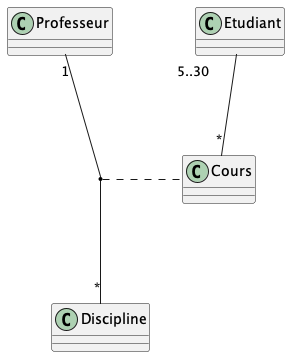

# Diagramme de classe

## Vrai ou faux

Etant donné le diagramme de domaine ci-dessus, les assertions suivantes sont-elles vraies ou fausses ? 
- Etudiant est une classe d’association : **Faux**
- Un étudiant peut participer à autant de cours qu’il veut : **Faux**
- Plusieurs professeurs peuvent enseigner la même discipline : **Vrai**
- Un professeur peut enseigner plusieurs disciplines : **Vrai**
- Un cours peut être enseigné à 2 étudiants : **Faux**
- Un cours peut être enseigné à 20 étudiants : **Faux**

## Question ouverte

Représentez la même association avec la notation UML « petit losange » 

- Quelles informations perd-on par rapport au diagramme ci-dessus ? Avec la notation petit losange on perderait les
détails sur la cardinalité des associations. Nous aurions donc une vue simplifiée de l'association, sans les détails
concernant par exemple le fait qu'un étudiant puisse avoir de zéro à plusieurs cours, etc.